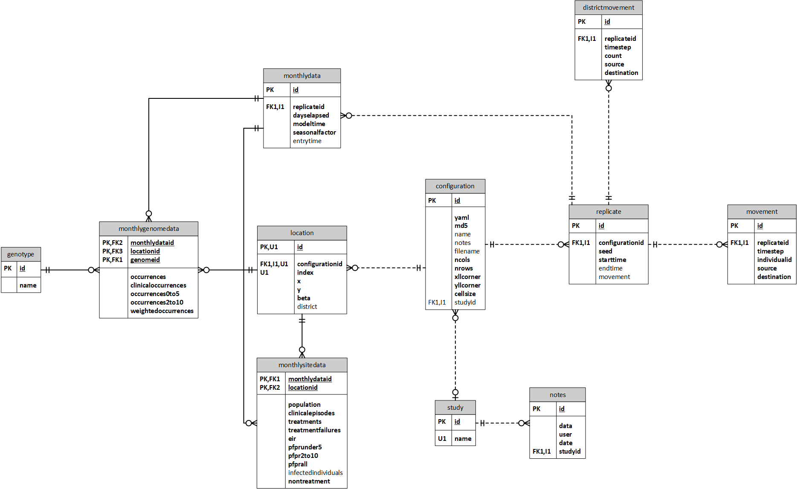

# Simulation Database Infrastructure

Due to the complexity of data storage requirements for simulations involving multiple cells, a database is provided through the `dbreporter` reporter class. The schema is outlined below and was developed against PostgreSQL due to the high storage requirements. Note that the `notes` table presume the usage of the [MaSimLIMS](https://github.com/rjzupkoii/MaSimLIMS) and can be removed if not needed with no impact upon the simulation.     



## Installation

The following guide is intended provide a walk through of how to get the Malaria Simulation (MaSim) database up and running. While the document is kept as general as opposed, there may be some differences that you encounter due to your local IT requirements. The following guide assumes that the server is running a clean installation of Ubuntu 18.04 LTS 64-bit with ports 80, 443, and 5432 open.

### Hardware Requirements

The specific requirements for the server are dependent in part upon the number of instances that will be connecting to it while a simulation is running. However, as a baseline the following is a reasonable starting point for a virtual machine:

- 4 CPUs
- 8 GB RAM
- 800 GB primary disk
- Ubuntu 18.04 LTS 64-bit

### Installing PostgreSQL

1. Connect to the server

```bash
ssh [User]@[IP address] -p [port]
```

2. Set the default encoding on the server, the setting can be verified by running `locale`

```bash
export LANG=en_US.UTF-8
```

2. Install the GPG key and repository for PostgreSQL packages

```bash
sudo apt-get install wget ca-certificates
wget --quiet -O - https://www.postgresql.org/media/keys/ACCC4CF8.asc | sudo apt-key add -
sudo sh -c 'echo "deb http://apt.postgresql.org/pub/repos/apt/ `lsb_release -cs`-pgdg main" >> /etc/apt/sources.list.d/pgdg.list'
```

3. Install PostgreSQL

```bash
sudo apt-get update
sudo apt-get install postgresql postgresql-contrib
```

4. Verify connection to PostgreSQL

```bash
sudo -u postgres psql postgres
postgres-# \conninfo
postgres-# \q
```

5. Create administrative user

Be sure to supply the password and select yes when asked if the user should be a super user.

```bash
sudo -u postgres createuser --interactive --pwprompt
```

6. Configure the server to listen for connections

This is done by first editing the file `/etc/postgresql/11/main/postgresql.conf` and updating the line `listen_addresses='*'`. Next, the file `/etc/postgresql/11/main/pg_hba.conf` needs to have the line `host all all 0.0.0.0/0 md5` added at the end. Note that this means that the server will listen to connections from *any* IP address. If this is not desired behavior, a more restrictive configuration should be used.

7. Enable service

```bash
sudo update-rc.d postgresql enable
```

Optional. Update default locale for the database template. This is necessary if you get an error that states "Encoding UTF8 does not match locale en_US. The chosen LC_CTYPE setting requires encoding LATIN1" from pgAdmin when creating a database

```bash
sudo -u postgres psql postgres

update pg_database set datistemplate=false where datname='template1';
drop database Template1;
create database template1 with owner=postgres encoding='UTF-8' lc_collate='en_US.utf8' lc_ctype='en_US.utf8' template template0;
update pg_database set datistemplate=true where datname='template1';
\q
```

## Installation of pgAdmin

The prefered way of installing pgAdmin on a clean Ubunut installation is though the use of `apt`:

1. Configure the system for the pgAdmin APT repository.

```bash
sudo apt install curl
sudo curl https://www.pgadmin.org/static/packages_pgadmin_org.pub | sudo apt-key add
sudo sh -c 'echo "deb https://ftp.postgresql.org/pub/pgadmin/pgadmin4/apt/$(lsb_release -cs) pgadmin4 main" > /etc/apt/sources.list.d/pgadmin4.list && apt update'
```

2. Install pgAdmin

```bash
sudo apt install pgadmin4-web 
sudo /usr/pgadmin4/bin/setup-web.sh
```

### Configuration of Apache for pgAdmin

Since newer version of pgAdmin are designed for web enviroments, configuration following installation may be limited editing the `pgadmin4.conf` configuration to reside at the server root:

```xml
WSGIDaemonProcess pgadmin processes=1 threads=25 python-home=/usr/pgadmin4/venv
WSGIScriptAlias / /usr/pgadmin4/web/pgAdmin4.wsgi

<Directory /usr/pgadmin4/web/>
    WSGIProcessGroup pgadmin
    WSGIApplicationGroup %{GLOBAL}
    Require all granted
</Directory>
```

The configuration can then be relaoded as follows:

```bash
sudo a2dissite 000-default.conf
sudo a2ensite pgadmin4.conf
sudo systemctl restart apache2
```

At this point you should be able to connect to the pgAdmin control panel at http://[SERVER IP ADDRESS]. Login to the control panel using the credentials supplied during configuration. One logged in, you should be able to add the localhost via "Add New Server" and proceed with administration of the databases using pgAdmin. Additional deployment information can be found on [pgAdmin.org](https://www.pgadmin.org/) under [Server Deployment](https://www.pgadmin.org/docs/pgadmin4/5.7/server_deployment.html).

# Using the Database

## Creation of Simulation Database

After logging into the pgAdmin control panel, start by creating the user `sim` and ensuring they have permissions to login to the database. This is the user that will be the simulation to write results to the database during model execution. Next, run the script `database.sql` which can be found under the `/database` directory of this repository.

## Cloning databases

For the purposes of development or archiving it may be necessary to clone databases. The following SQL commands can be used from psql on the server to do so:

```sql
UPDATE pg_database SET datallowconn = false WHERE datname = 'masim';
CREATE DATABASE development WITH TEMPLATE masim OWNER sim;
UPDATE pg_database SET datallowconn = false WHERE datname = 'masim';
```


## Performance Tuning

The following settings from [PGTune](https://pgtune.leopard.in.ua/) where applied to the server:

```ini
# DB Version: 11
# OS Type: linux
# DB Type: dw
# Total Memory (RAM): 32 GB
# CPUs num: 8
# Connections num: 100
# Data Storage: san

max_connections = 100
shared_buffers = 8GB
effective_cache_size = 24GB
maintenance_work_mem = 2GB
checkpoint_completion_target = 0.9
wal_buffers = 16MB
default_statistics_target = 500
random_page_cost = 1.1
effective_io_concurrency = 300
work_mem = 10485kB
min_wal_size = 4GB
max_wal_size = 8GB
max_worker_processes = 8
max_parallel_workers_per_gather = 4
max_parallel_workers = 8
```
